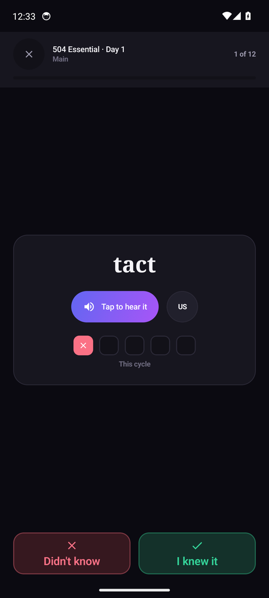
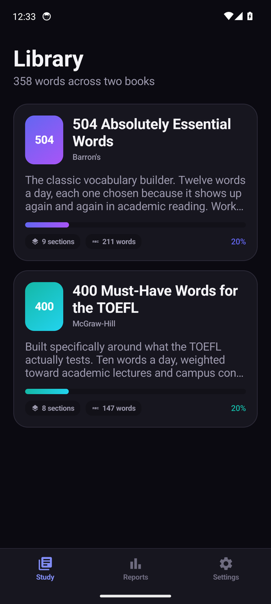
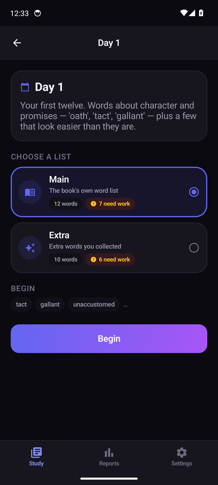
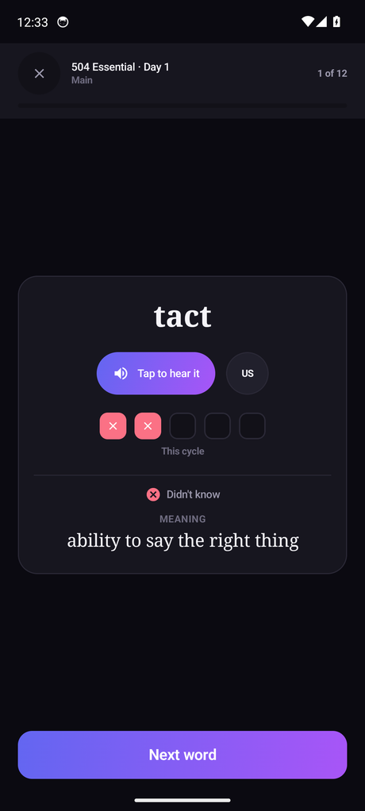
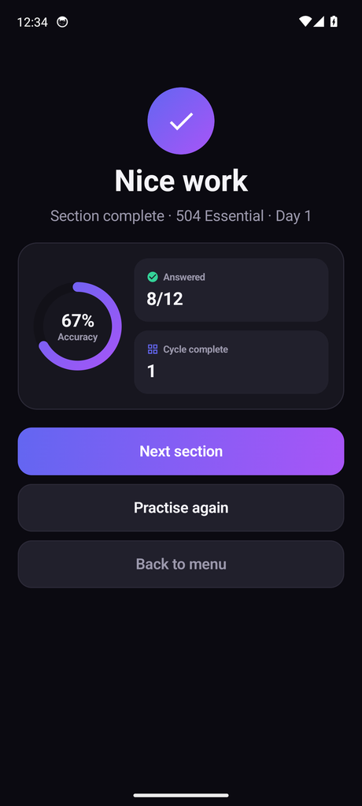
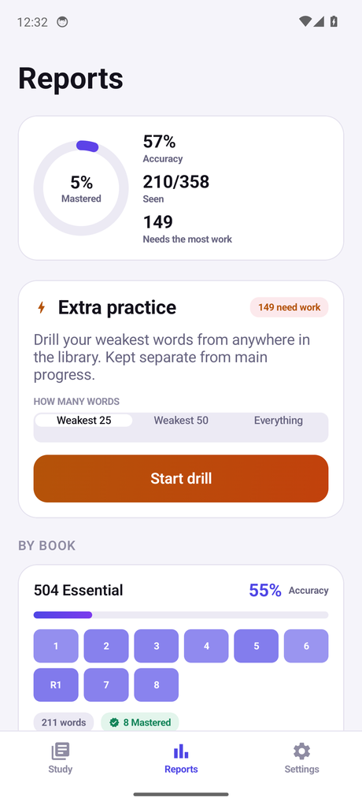
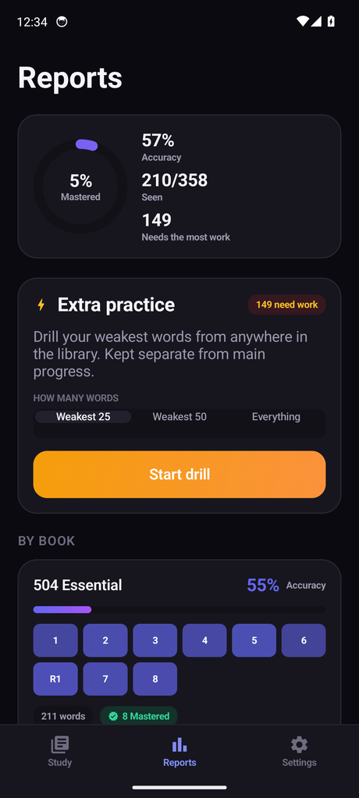

<div align="center">

# TOEFL Vocab — Android


### Offline Android vocabulary trainer built entirely on Windows — no Android Studio, no local SDK, no emulator on the developer's machine

[](https://kotlinlang.org/)
[](https://developer.android.com/jetpack/compose)
[](https://gradle.org/)
[](https://developer.android.com/reference/android/speech/tts/TextToSpeech)
[](.github/workflows/ci.yml)
[](https://developer.android.com/)
[](https://github.com/a1mohamad/toefl-vocabs-android-app/actions)
[](LICENSE)

**Research and Data**

[](app/src/main/assets/VocabData/vocabs.json)
[](docs/PROJECT_PLAN.md)
[](https://github.com/a1mohamad/toefl-vocabs-ios-app)

**Contact and Profiles**

[](mailto:a1mohamad.askari@gmail.com)
[](https://a1mohamad.github.io)
[](https://github.com/a1mohamad)
[](https://www.linkedin.com/in/amirmohammad-askari/)
[](https://www.kaggle.com/amirmohamadaskari)

<br>



</div>

**TOEFL Vocab** is an offline vocabulary trainer built on two classic word
lists — **504 Absolutely Essential Words** (Barron's) and **400 Must-Have Words
for the TOEFL** (McGraw-Hill). No account, no server, no subscription: the
content ships inside the app and progress is a single file on the device.

This is a **port of the SwiftUI original**, screen for screen. Every rule, every
number, every piece of copy and every button is the same; what changed is the
platform underneath. The [Porting Notes](#porting-notes) section lists every
place the two builds genuinely differ and why.

The unusual part is how it is built. Every commit is compiled, tested and
screenshotted by **GitHub Actions**, because the developer's machine has no
Android SDK on it. Nothing is ever built locally.

---

## Table of Contents

- [Screenshots](#screenshots)
- [How It Works](#how-it-works)
- [Why This Project Is Interesting](#why-this-project-is-interesting)
- [Features](#features)
- [Content Model](#content-model)
- [Architecture](#architecture)
- [Application Modules](#application-modules)
- [Repository Structure](#repository-structure)
- [The No-Local-Build Workflow](#the-no-local-build-workflow)
- [CI/CD Pipeline](#cicd-pipeline)
- [Testing](#testing)
- [Porting Notes](#porting-notes)
- [Adding Vocabulary](#adding-vocabulary)
- [Installing on a Device](#installing-on-a-device)
- [Building Locally](#building-locally-optional)
- [Current Scope and Limitations](#current-scope-and-limitations)
- [License](#license)

---

## Screenshots

Every screen below is captured automatically by CI on each push — see
[CI/CD Pipeline](#cicd-pipeline). Nothing here was taken by hand.

| Library | Section |
|:---:|:---:|
|  |  |
| Both books, with progress at a glance | Main / Extra picker, with the adaptive queue previewed |

| Meaning Revealed | Section Complete |
|:---:|:---:|
|  |  |
| Self-grade, then the definition appears | Accuracy, cycles completed, and where to go next |

### Light and Dark

Both appearances are first-class and verified on every CI run:

| Light | Dark |
|:---:|:---:|
|  |  |

The run captures all nine screens in both appearances — eighteen images — and
uploads the full set as the `emulator-screenshots` artifact. The seven committed
here are the ones this page shows; to refresh them, download the artifact and
run:

```bash
python Scripts/prepare_screenshots.py path/to/downloaded/artifact
```

---

## How It Works

Pick a book, pick a day, pick the **Main** or **Extra** list. Words come up one
at a time: hear it, decide whether you knew it, then the meaning is revealed.
Five boxes under each word track your last five answers — when the fifth lands
the row banks and resets for the next cycle.

Open a section again and the words you have been getting **wrong come first**.
A section you have never touched plays in book order.

**Reports** rolls everything up and launches an **Extra Practice** drill across
the whole library, ranked by what you are worst at. The drill keeps its own
counters and never moves your main progress.

---

## Why This Project Is Interesting

The build constraints shaped almost every technical decision in the repository:

- **No Android Studio, no local SDK, no local emulator.** Development happens
  in a text editor on Windows. The only place Kotlin is ever compiled is a
  GitHub Actions runner.
- **No Compose previews.** No `@Preview` panel, no Live Edit, no layout
  inspector. A change is only verified once it reaches CI.
- **No Play Console.** Tagged releases are signed in GitHub Actions using a
  keystore and passwords stored as repository secrets, never in source control.
- **The repository must stay public.** That is what keeps GitHub Actions minutes
  free.
- **Almost no dependencies.** Compose, Material icons and
  `kotlinx.serialization`, and nothing else. The bar chart on Reports is drawn
  on a `Canvas` rather than pulling in a charting library; navigation is two
  lists of routes rather than a navigation graph.

Because there is no local emulator, the unit tests and the content validator
carry more weight than they would in a normal Android project — they are the
only fast feedback that exists before a full CI round trip.

---

## Features

### Study Flow

- Separate books, with an introduction before each book and each section.
- Words presented one at a time, in adaptive order.
- Two-choice self-grading (**I knew it** / **Didn't know**), with the meaning
  revealed immediately after.
- A five-box checklist per word tracks recent accuracy; a completed cycle stays
  visible as a "last 5" recap before resetting.
- Section-complete screen offers **Next section**, **Practise again**, or
  **Back to menu**.

### Adaptive Ordering

- Reopening a section always surfaces the most-missed words first.
- Deterministic and score-based — Laplace-smoothed error rate, recency bonus,
  mastery decay — so the same history always produces the same queue.
- An untouched section plays in book order.

### Extra Practice

- A separate drill, launched from Reports, spanning the whole library.
- Ranked by main-mode weakness, so it targets what study has shown is weak.
- Keeps independent right/wrong counters — never affects main progress.
- Scope selector: weakest 25, weakest 50, or everything.

### Reports

- Mastery ring, accuracy, and a per-book **section heat grid** rather than a
  long list of rows.
- Recent-session accuracy trend.
- Main vs. Extra split and run number.

### Pronunciation

- Platform `TextToSpeech` with selectable US / UK / AU accents and an adjustable
  speech rate — fully on-device, no bundled audio files, no network access.

### Accessibility and Localization

- Everything sized in `sp`, so all body text scales with the system font-size
  setting. No fixed text sizes.
- Multi-part controls collapse into single readable elements for TalkBack.
- English and Persian, with automatic right-to-left layout for Persian.

---

## Content Model

All vocabulary lives in `app/src/main/assets/VocabData/vocabs.json`, bundled
into the APK — nothing is fetched from a server. The file is keyed book →
section → category, and word order is stored explicitly as an array, because a
JSON *object* has no guaranteed key order:

```json
{
  "504": {
    "day_1": {
      "main": [
        { "term": "abandon", "definition": "desert; leave without planning to come back" }
      ],
      "extras": [
        { "term": "disobey", "definition": "fail to obey" }
      ]
    }
  }
}
```

Each section carries two lists: **main**, the book's own words, and **extras**,
additional words collected alongside them. Either may be absent — a review
section with no extras simply does not offer that list.

A second file, `catalog.json`, supplies **book and section order**, titles and
intro copy — the same ordering problem one level up. Without it, no sort
function would know that a review section belongs between two numbered days
rather than after all of them. A section missing from the catalog still works:
it is appended at the end with a generated title rather than hidden.

Both files are byte-identical to the iOS build's.

---

## Architecture

MVVM, with a `Router` standing in for a coordinator:

```text
app/src/main/java/io/github/a1mohamad/toeflvocab/
    app/             entry point, dependency wiring, root tab screen
    navigation/      Router, Route, PracticeConfiguration
    core/
        models/        content and progress data types
        content/       VocabCatalogLoader
        persistence/   ProgressStore, SettingsStore, ProgressBackup
        engine/        AdaptiveOrdering, StatsAggregator
        audio/         PronunciationService, Haptics
        localization/  Strings, LayoutDirectionBridge
    designsystem/    palette, typography, shared components
    features/        library, book, section, practice, reports, settings
```

Five observable stores are created once in `MainActivity` and provided through
`CompositionLocal`s — `ContentProvider`, `ProgressStore`, `SettingsStore`,
`PronunciationService`, `Router`. Only the practice screen has a dedicated view
model; everything else is a pure function of the stores, recomputed on
recomposition.

Progress persists as a single serialized file rather than Room or DataStore: the
whole dataset is a few hundred small records, and with no local emulator a
schema bug would cost a full CI round trip just to observe. The saved format is
byte-identical to the iOS build's, so a backup exported there restores here.

---

## Application Modules

| Module | Responsibility |
|---|---|
| `core/content/VocabCatalogLoader.kt` | Merges `vocabs.json` and `catalog.json` into an ordered, indexed catalog |
| `core/engine/AdaptiveOrdering.kt` | Scores and orders words by weakness; drives both study and the drill |
| `core/engine/StatsAggregator.kt` | Rolls per-word history up into the Reports screen |
| `core/persistence/ProgressStore.kt` | Atomic, debounced persistence of all practice history |
| `core/audio/PronunciationService.kt` | `TextToSpeech` wrapper with accent and rate control |
| `core/localization/Strings.kt` | String table with English/Persian resolution and RTL support |
| `features/practice/PracticeViewModel.kt` | The practice session state machine |
| `features/reports/ReportsScreen.kt` | Mastery ring, section heat grid, weakest-words list, drill launcher |
| `navigation/Router.kt` | Tab and stack navigation, modal practice sessions |

---

## Repository Structure

```text
toefl-vocabs-android-app/
|-- settings.gradle.kts             module list and repositories
|-- build.gradle.kts                plugin versions, applied per module
|-- gradle/libs.versions.toml       the single place any version is written
|-- app/
|   |-- build.gradle.kts
|   +-- src/
|       |-- main/
|       |   |-- AndroidManifest.xml
|       |   |-- assets/VocabData/   all words + book/section order (bundled)
|       |   |-- res/                launcher icon, launch-window theme
|       |   +-- java/...            application source (see Architecture)
|       +-- test/java/...           engine, loader and localisation tests
|-- assets/                         README screenshots and icon
|-- Scripts/                        content validator, migrator, icon builder (run on Windows)
|-- docs/PROJECT_PLAN.md            full design notes and algorithm rationale
+-- .github/workflows/ci.yml
```

---

## The No-Local-Build Workflow

There is no Gradle and no Android SDK on this machine, so the local loop is
content validation rather than compilation:

```bash
python Scripts/validate_content.py
```

Checks both JSON files, catches duplicate terms, empty definitions, stray
whitespace and catalog/data mismatches, and prints a word-count table. Runs in
about a second. Run it before every push.

```bash
python Scripts/migrate_vocabs.py
```

Converts legacy `{term: definition}` blocks into the ordered-array form. Run it
after pasting new content in the old style.

```bash
python Scripts/make_app_icon.py path/to/artwork.png
```

Rebuilds every launcher icon density plus the adaptive icon's foreground layer,
scaling the artwork into the 72-of-108dp safe zone so the launcher's mask does
not crop it. Requires `pip install Pillow`.

Everything else — compiling, running the tests, rendering the UI — happens only
once code reaches GitHub Actions.

---

## CI/CD Pipeline

`.github/workflows/ci.yml` runs four jobs:

```text
push / pull_request
        |
        v
content-lint          (ubuntu, ~15s -- gates everything below)
        |
        +----------------------------+
        |                            |
        v                            v
unit-tests                  emulator-check
(ubuntu, gradle test)       (ubuntu, build + verify APK + screenshot)
                                      |
                                      v
                             every screen x light/dark

tag matching v*
        |
        v
release-build          (ubuntu, assembleRelease)
        |
        v
signed .apk artifact    -> downloaded and installed with adb or sideloading
```

| Job | Trigger | Purpose |
|---|---|---|
| `content-lint` | every push/PR | `validate_content.py --strict`; gates the build jobs so a bad JSON edit never costs a build minute |
| `unit-tests` | every push/PR | `gradle testDebugUnitTest` — the only fast feedback on the practice engine |
| `emulator-check` | every push/PR | Builds, verifies the bundled JSON and launcher icon are actually inside the APK, then screenshots every screen in light and dark |
| `release-build` | tags matching `v*` | Restores the keystore from Actions secrets, runs `assembleRelease`, verifies the APK signature, and uploads an installable artifact |

The screenshots come straight out of `emulator-check`. The app is relaunched
once per screen with a `screenshot` intent extra, seeds deterministic progress
so Reports and the checklists are never captured empty, and opens directly to
that page — no UI automation to go stale.

The APK-verification step exists because a dropped asset produces an app that
builds, launches and screenshots fine while being completely empty — a failure
mode that would otherwise look like a UI bug and cost a full round trip to
diagnose.

---

## Testing

With no local emulator, the unit tests are the only verification available
before a CI round trip, so they target the logic that a screenshot cannot show:

| File | Covers |
|---|---|
| `WordStatsCycleTest.kt` | The five-answer cycle rule, recap display, and persistence resilience against a hand-edited or truncated save file |
| `AdaptiveOrderingTest.kt` | The weakness-scoring formula, ordering determinism, and the Extra Practice queue |
| `VocabCatalogLoaderTest.kt` | Book/section ordering against `catalog.json`, legacy word-format fallback, and graceful degradation on missing content |
| `ReportingAndStringsTest.kt` | Stats aggregation, run-completion logic, and bilingual string-table coverage |

```bash
gradle testDebugUnitTest
```

They are plain JVM tests with no Android dependencies, so they need only a JDK —
no SDK, no emulator.

---

## Porting Notes

Everything a user can see or do is the same. These are the places the two
codebases genuinely differ, and why.

| Area | iOS | Android | Why |
|---|---|---|---|
| Icons | SF Symbols, named by string | `AppSymbol` enum → Material Icons | The two icon sets are not the same, so each one had to be re-chosen. An enum makes a wrong name a compile error rather than a blank square found in CI. `chevron.forward` and the back arrow map to *auto-mirrored* variants so Persian still flips them. |
| Rounded font | `.system(design: .rounded)` | Platform default | Android has no rounded system face. The weights that carried the hierarchy are unchanged. |
| Charts | Swift Charts | Compose `Canvas` | Swift Charts is a system framework; every Android equivalent is a third-party dependency. Twelve bars did not justify one. |
| Navigation | `NavigationStack(path:)` | `List<Route>` + `BackHandler` | The original rewrites its path array wholesale ("back to menu" empties it). A navigation graph would turn those single state changes into multi-step animations. |
| Value types | Mutating `struct`s | Immutable `data class`es | Swift gets value semantics for free. In Kotlin a shared mutable record would both alias into the progress map and fail to trigger recomposition, so `record()` returns a new value. |
| Speech rate | `AVSpeechUtterance`, 0.5 is normal | `TextToSpeech`, 1.0 is normal | The *stored* value keeps AVFoundation's scale so a settings blob is interchangeable and the Slow/Normal/Fast thresholds did not move. `PronunciationService` converts at the point it talks to the engine. |
| Rate clamping | Clamped in `init` | `clampedSpeechRate` accessor | A Kotlin `data class` cannot rewrite a `val` in `init`. Every read site uses the clamped accessor, so behaviour is identical for any value the slider can produce and for hand-edited files. |
| Voice availability | Every English locale ships | May report `LANG_MISSING_DATA` | Android engines can be missing a locale the user never downloaded, so the accent falls back through the other two rather than going silent. |
| Haptics | `UIFeedbackGenerator` | `View.performHapticFeedback` | The View API is what respects the system-wide haptics setting and needs no permission. |
| Backup files | `fileExporter` / `fileImporter` | Storage Access Framework | Same two-step flow — decode and validate *before* prompting to overwrite. |
| Reduce motion | `accessibilityReduceMotion` | Animator duration scale of 0 | Android has no single switch; the duration scale is the signal apps are expected to read. |
| Debug harness | `#if DEBUG`, launch argument | `if (BuildConfig.DEBUG)`, intent extra | `am start` passes extras, not argv. R8 folds the constant and strips the branch from release. |
| Distribution | Sideloadly, expires weekly | Signed APK, no expiry | Android has no equivalent of the free-provisioning 7-day limit. |

---

## Adding Vocabulary

1. Append to `app/src/main/assets/VocabData/vocabs.json`:

   ```json
   "day_9": {
     "main": [
       { "term": "ubiquitous", "definition": "found everywhere" }
     ]
   }
   ```

2. Add one line to `catalog.json` for the title and intro. Skipping this still
   works — the section is appended last with a generated title.
3. Run the validator, then commit. No Kotlin changes needed.

---

## Installing on a Device

Regular pushes only run the emulator check. An installable build needs a version
tag:

```bash
git tag v1.2.1
```

```bash
git push origin v1.2.1
```

Download the signed APK artifact from the workflow run, then either:

```bash
adb install -r TOEFLVocab-v1.2.1.apk
```

or copy it to the phone and open it with "install unknown apps" enabled for your
file manager.

> Unlike the iOS build, nothing expires. Keep the signing keystore backed up:
> every future update must be signed with the same key.

---

## Building Locally (Optional)

Nothing in this repository requires it, but if you do want a local build you
need a JDK 17 and the Android command-line tools — Android Studio is not
required. The [minimum setup is about 3 GB](#the-no-local-build-workflow) of
downloads:

```bash
sdkmanager "platform-tools" "platforms;android-35" "build-tools;35.0.0"
```

```bash
gradle assembleDebug
```

To get `./gradlew` working on a fresh clone, generate the wrapper jar once —
it is a binary and cannot be committed by hand:

```bash
gradle wrapper
```

---

## Current Scope and Limitations

Current scope:

- Offline, single-device vocabulary practice
- Bundled word lists, English content, English/Persian UI
- Sideloaded distribution via a CI artifact, not Google Play

Current limitations:

- No push notifications and no cloud sync — the app makes no network calls at
  all, by design
- No local build or emulator; every change is verified through CI
- The release APK is signed for direct installation, but Play Store
  distribution is not configured
- Progress does not sync across devices, though it can be exported and imported
  as a file — including to and from the iOS build

---

## License

This project is licensed under the MIT License.

See the [LICENSE](LICENSE) file for details. The license covers the source code,
build configuration and tooling. It does not cover the vocabulary word lists,
whose selections derive from the two published books and remain the property of
their publishers — the definitions here are the author's own study notes. See
[NOTICE](NOTICE) for the full wording.
